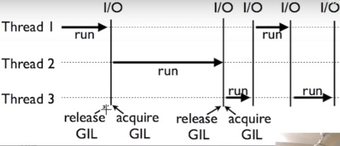

# Threading + Multiprocessing(多线程和多进程）
## 一.定义和区别
* 1.多线程：线程是CPU调度的最小单位，只能调度cpu的资源。
* 2.多进程：进程是资源分配的最小单位，能调度所有的cpu核，比如cpu有多核，那么进程能同时调度多核。
* 3.共性：都是并行计算
* 4.差别（多线程）：多线程是指比如只有一条道路，a用了，b就用不了，但是如果能够a用完了，b立马就用上，这样就能够节省时间的开销了，并且也充分利用资源。
* 5.差别（多进程）：多进程能够充分利用cpu的多核能力（每一个核有单独的逻辑空间，每一个核不会收到GIL的影响），这样就能充分利用多核CPU了，比如应用在处理数据上，就比多线程要好很多了。
## 二.多线程
* 1.创建线程 
```python
def job1():
    print("Thread_2 start\n")
    print("Thread_2 end\n")
# 不能加()，因为要传的是函数名（Python一切皆对象，函数也是对象，可以当参数传递，
# 传的是这个函数的引用），如果加（）表示执行函数，再将结果赋值给target
thread1 = threading.Thread(target=job1,name = 'T1')
thread1.start()
```
* 2.等待所有进程全部结束再执行之后的命令join
```python
 thread_1 = threading.Thread(target=thread_job_1,name="Thread_1")
 thread_2 = threading.Thread(target=thread_job_2,name = "Thread_2")
 thread_1.start()
 thread_2.start()
 thread_1.join()
 thread_2.join()
```
* 3.让某个线程先执行，执行完之后再执行下一个线程 lock
```python
lock = threading.Lock()
lock.acquire()
代码（执行某一个线程）
lock.release()
```
* 4.图解


## 三.多进程
* 1.创建进程
```python
 p1 = mp.Process(target=job,args=())
 p2 = mp.Process(target=job,args=())
 p1.start()
 p2.start()
 p1.join()
 p2.join()
```
* 2.需要再进程job的返回值，这时需要用到Queue
```python
def job(q):
    result = 0
    for i in range(1000):
        result += i + i**2
    q.put(result)

if __name__ == '__main__':
    """多进程必须要再main下运行，不然会报错"""
    q = mp.Queue()
    p1 = mp.Process(target=job,args=(q,))
    p2 = mp.Process(target=job,args=(q,))
    p1.start()
    p2.start()
    p1.join()
    p2.join()
    result1 = q.get()
    print(result1)
    result2 = q.get()
    print(result2)
    print("All done!")
```
* 3.进程池：有了池子之后，就可以让池子对应某一个函数，我们向池子里丢数据，池子就会返回函数返回的值。 Pool和之前的Process的不同点是丢向Pool的函数有返回值，而Process的没有返回值。
```python
def job(x):
    return x*x
def multiCore():
    # pool 默认是所有的核
    pool = mp.Pool(processes=3) # 这里用3个核
    result = pool.map(job,range(10))
    print(result)
    result2 = pool.apply_async(job,(2,)) #需要迭代的，必须有逗号
    print(result2.get())
    # 迭代一个list
    multi_result = [pool.apply_async(job,(i,)) for i in range(10)]
    print([multi_result_single.get() for multi_result_single in 	     	 multi_result])
if __name__ == '__main__':
    multiCore()
```
* 4.共享内存：类似于全局变量，再多个进程中，共享某一个变量的值

* 5.进程锁：当某一个进程计算完成之后，得到的值接着有另外的进程计算
```python
def job(v,num,l):
    l.acquire()
    for _ in range(10):
        time.sleep(0.1)
        v.value += num
        print("value : {}".format(v.value))
    l.release()
def multiCore():
    # 定义进程锁(先p1计算好之后的value，
    # p2基于p1最后结果再进行计算，不相互干扰)
    lock = mp.Lock()
    # 定义共享内存value
    value = mp.Value('i',0)
    array = mp.Array('i',[1,2,3]) # 只能一维
    p1 = mp.Process(target=job,args=(value,1,lock))
    p2 = mp.Process(target=job,args=(value,3,lock))
    p1.start()
    p2.start()
    p1.join()
    p2.join()
    print("All done!")

if __name__ == '__main__':
    multiCore()
```
## 四.进程与线程与不加任何的对比
同时用2个线程，2个进程，不加任何线程进程来计算，迭代次数越长，效果：进程 >不加 > 线程
```bash
MultThread Using Time: 0.6303138732910156
MultiThread: 666666666666000000
Normal Using Time: 0.6043837070465088
Normal: 666666666666000000
MultCore Using Time: 0.399930477142334
MultiCore: 666666666666000000
```

